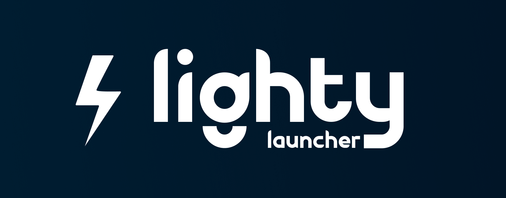

# LightyLauncherLib

[](#)
[](https://crates.io/crates/lighty-launcher)
[](https://hamadi.gitbook.io/lightylauncher)
[](https://opensource.org/licenses/MIT)
[](https://www.rust-lang.org)
[](https://github.com/Kalandi)

<p align="center">
  
</p>

## A launcher built with LightyLauncherLib

[exemple_launcher_with_lightylauncherlib_small.webm](https://github.com/user-attachments/assets/36134ddf-935b-4f2d-9047-78c8d6504ade)

## Quick start

```toml
[dependencies]
lighty-launcher = { version = "26.5.10", features = ["vanilla"] }
tokio = { version = "1", features = ["full"] }
anyhow = "1.0"
```

```rust
use lighty_launcher::prelude::*;

#[tokio::main]
async fn main() -> anyhow::Result<()> {
    AppState::init("MyLauncher")?;

    let mut instance = VersionBuilder::new(
        "my-instance",
        Loader::Vanilla,
        "",
        "1.21.1",
    );

    let mut auth = OfflineAuth::new("Player123");
    let profile = auth.authenticate().await?;

    instance
        .launch(&profile, JavaDistribution::Temurin)
        .run()
        .await?;

    Ok(())
}
```

Microsoft auth, modpacks, event streams, every loader — runnable
samples in [`examples/`](examples/).

## What you get

- **Light.** Only ships what you use. A pure-Fabric build never pulls in the Forge pipeline.
- **Fast.** Mods, libs, assets, resourcepacks, shaders — downloaded in parallel.
- **Mods & modpacks just work.** Drop a Modrinth slug or a CurseForge id and the file lands in the right folder. `.mrpack` and `.zip` modpacks supported out of the box.
- **Tokens stay yours.** Microsoft and Azuriom secrets can't leak through logs or JSON dumps. OS keychain storage is one method call away.
- **You see everything.** Typed events stream every step on a broadcast bus — perfect for a real-time UI.

## Architecture

```
lighty-launcher/             # Root crate (prelude + feature gates)
└── crates/
    ├── core/                # AppState, HTTP, hashing, extract
    ├── auth/                # Offline / Microsoft / Azuriom
    ├── event/               # Broadcast bus + typed events
    ├── java/                # JRE auto-download
    ├── launch/              # Install + game lifecycle
    ├── loaders/             # Vanilla / Fabric / Quilt / Forge / NeoForge
    ├── modsloader/          # Modrinth + CurseForge + modpack pipelines
    └── version/             # VersionBuilder
```

## Cargo features

| Feature | Effect |
|---|---|
| `vanilla` / `fabric` / `quilt` / `neoforge` / `forge` | Enable that loader (`forge` covers modern + legacy 1.7.10–1.12.2) |
| `lighty_updater` | Custom updater backend (auto-pulls vanilla/fabric/quilt/neoforge/forge) |
| `all-loaders` | Every loader above |
| `modrinth` | Modrinth API + `.mrpack` modpack support |
| `curseforge` | CurseForge API + `.zip` modpack support (requires API key) |
| `all-mods` | Both `modrinth` and `curseforge` |
| `events` | Typed broadcast events (`LaunchEvent`, `ModloaderEvent`, …) |
| `keyring` | OS-keychain storage for auth tokens (opt-in) |
| `tracing` | Structured logging via `tracing` |

Mix and match:

```toml
lighty-launcher = { version = "26.5.10", features = ["fabric", "modrinth", "events"] }
```

## Documentation

📚 **Full docs on GitBook**: <https://hamadi.gitbook.io/lightylauncher>

Per-crate API reference next to the code:

| Crate | What it does |
|---|---|
| [`lighty-core`](crates/core/README.md) | App state, HTTP, hashing, archive extract |
| [`lighty-auth`](crates/auth/README.md) | Offline / Microsoft / Azuriom auth |
| [`lighty-event`](crates/event/README.md) | Broadcast event bus |
| [`lighty-java`](crates/java/README.md) | JRE download and discovery |
| [`lighty-launch`](crates/launch/README.md) | Install orchestrator + game runner |
| [`lighty-loaders`](crates/loaders/README.md) | Minecraft loader implementations |
| [`lighty-modsloader`](crates/modsloader/docs/overview.md) | Mod sources + modpack parsers |
| [`lighty-version`](crates/version/README.md) | Fluent `VersionBuilder` |

## Contributing

PRs welcome — see [CONTRIBUTING.md](CONTRIBUTING.md).

## License

[MIT](LICENSE).

## Related

- **[LightyUpdater](https://github.com/Lighty-Launcher/LightyUpdater)** — companion server for custom modpack distribution.
