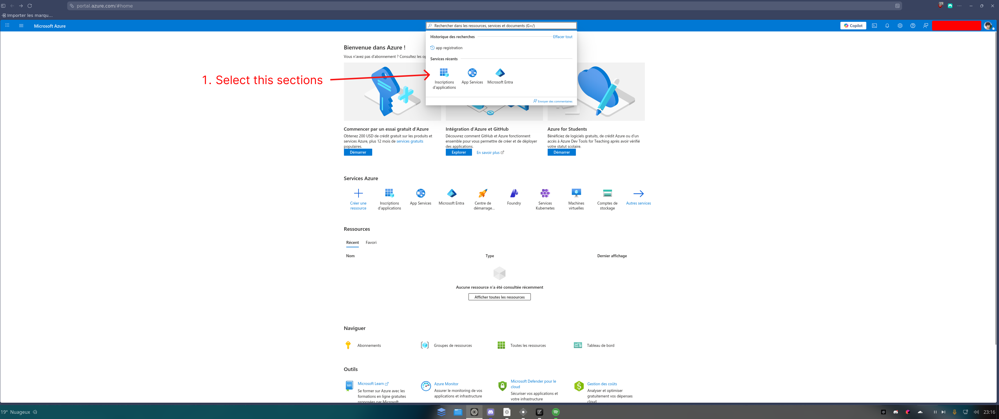
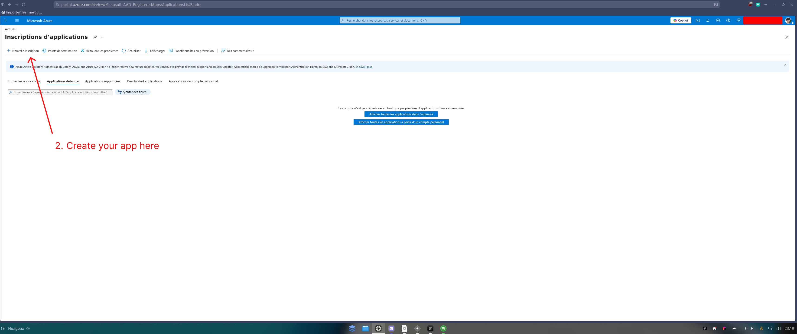
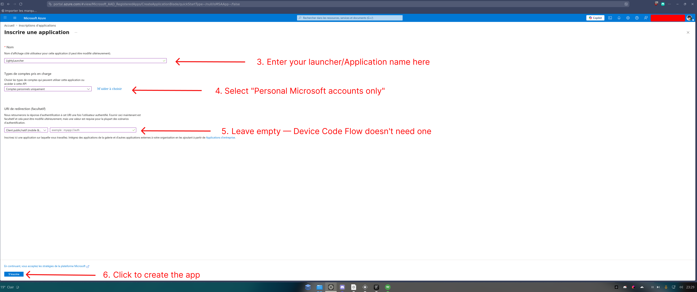
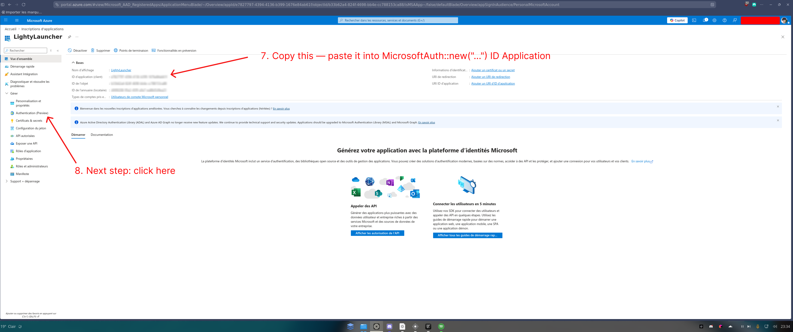
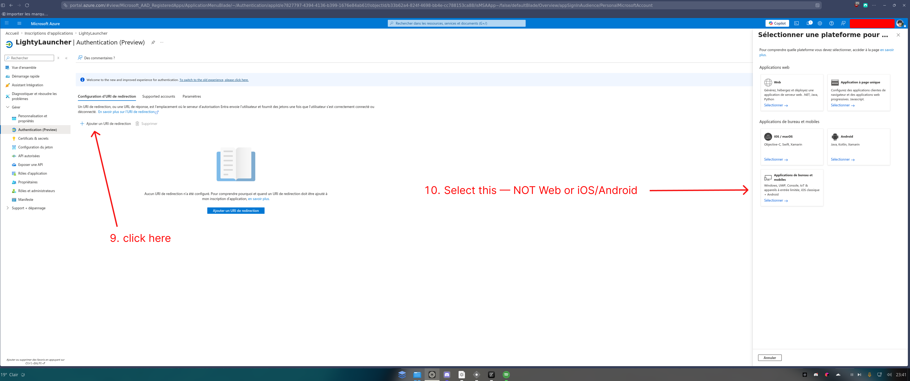
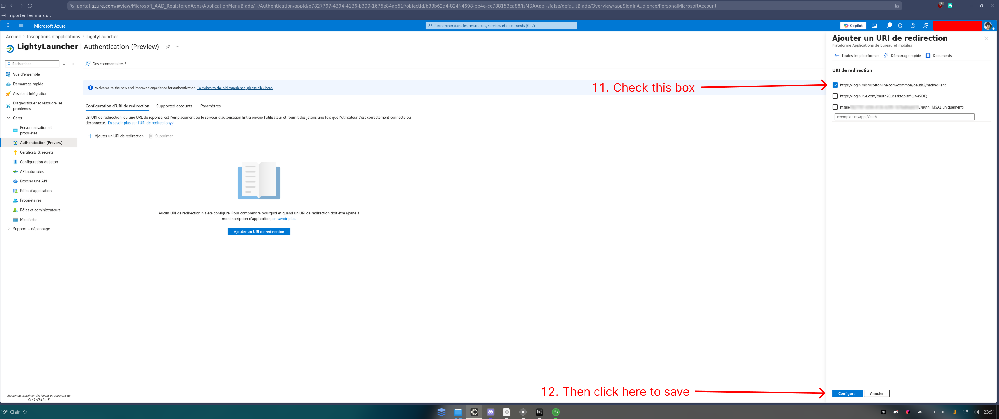
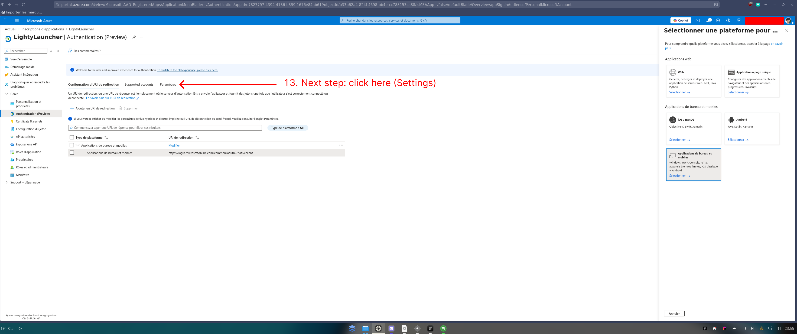
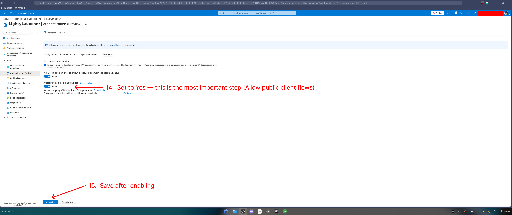

# Getting a Microsoft Azure App ID for Minecraft authentication

Before your launcher can authenticate players with their Microsoft accounts,
you need two things:

1. An **Azure AD app registration** configured as a public client.
2. **Mojang approval** for your client ID to call Minecraft Services.

This guide walks through every step with screenshots.

---

## Step 1 — Open App registrations in Azure Portal

Go to [portal.azure.com](https://portal.azure.com), search for
**"Inscriptions d'applications"** (App registrations) in the top search bar
and select it.

  

---

## Step 2 — Create a new registration

Click **+ Nouvelle inscription** (New registration).

  

---

## Step 3 — Fill in the registration form

- **Name** — enter your launcher display name (cannot contain: Mojang,
  Minecraft, Microsoft, Live, Xbox, Discord, Hypixel).
- **Supported account types** — select **"Personal Microsoft accounts only"**.
  Minecraft accounts are consumer accounts, not work/school accounts.
- **Redirect URI** — leave empty. Device Code Flow does not use one.
- Click **S'inscrire** (Register) at the bottom.

  

---

## Step 4 — Copy your Application (client) ID

On the **Overview** page after creation:

- Copy the **ID d'application (client)** — this is the value you pass to
  `MicrosoftAuth::new("...")`.
- Then click **Authentification** in the left menu to continue.

  

---

## Step 5 — Add the desktop platform

On the **Authentication** page, click **+ Ajouter un URI de redirection**
(Add a redirect URI), then in the panel that opens on the right select
**Applications de bureau et mobiles** (Mobile and desktop applications).
Do **not** select Web or iOS/Android.

  

---

## Step 6 — Check the nativeclient URI

Check the box next to
`https://login.microsoftonline.com/common/oauth2/nativeclient`
then click **Configurer** (Configure) to save.

  

---

## Step 7 — Go to the Parameters tab

Back on the **Authentication** page, click the **Paramètres** (Parameters) tab.

  

---

## Step 8 — Enable Allow public client flows

Set **Autoriser les flux clients publics** (Allow public client flows) to
**Yes**, then click **Enregistrer** (Save).

  

> This is the most critical step. Without it you get:
> `AADSTS70002: The provided client is not supported for this feature`

---

## Step 9 — Submit your App ID to Mojang for approval

Your client ID will be **rejected by Minecraft Services** with
`"Invalid app registration"` until Mojang whitelists it.
Submit the approval form at:

**<https://aka.ms/mce-reviewappid>**

You will need:
- **Application (client) ID** — from the Overview page.
- **Directory (tenant) ID** — also on the Overview page.
- A valid contact email that matches your Azure account.
- A short justification describing your launcher and why it needs access.

> Submissions are reviewed weekly. Do not submit multiple times.

---

## Common errors

| Error | Cause | Fix |
|---|---|---|
| `AADSTS70002` | Allow public client flows is disabled | Step 8 above |
| `Invalid app registration` | Client ID not approved by Mojang | Step 9 above |
| XSTS `2148916233` | Account does not own Minecraft Java Edition | — |
| XSTS `2148916238` | Xbox Live unavailable in the user's country | — |

---

## References

- [Microsoft authentication — Minecraft Wiki](https://minecraft.wiki/w/Microsoft_authentication)
- [Mojang AppID review form](https://aka.ms/mce-reviewappid)
- [Azure Portal](https://portal.azure.com)
- [Microsoft auth provider — this library](./microsoft.md)
