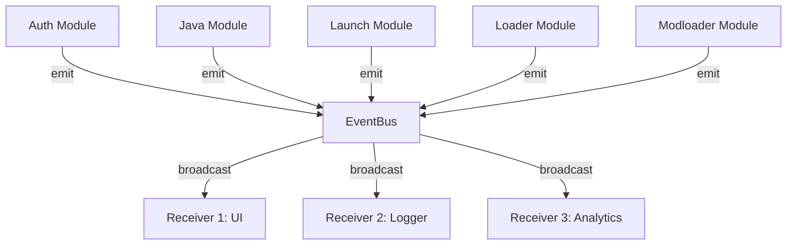

# Event System Architecture

## Design

The `Modloader` source covers the mod-source pipeline (dependency
resolver, modpack pipeline, per-bucket install summaries for
resourcepacks/shaderpacks/datapacks). Its variants previously lived
under `LaunchEvent`; they now reach receivers as
`Event::Modloader(ModloaderEvent::…)`.

## Flow

1. **Event Emission** - Modules emit events to EventBus
2. **Broadcasting** - EventBus broadcasts to all subscribers
3. **Processing** - Each receiver handles events independently

## Thread Safety

- Uses tokio `broadcast` channels
- Lock-free concurrent access
- Multiple subscribers supported

## See Also

- [Event Reference](./events.md)
- [Examples](./examples.md)
