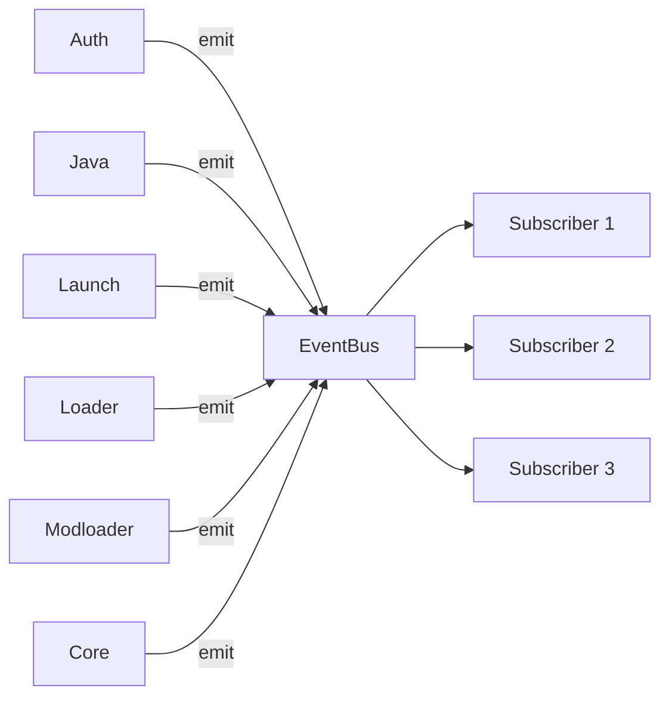

# Architecture

`EventBus` is a thin wrapper around `tokio::sync::broadcast::Sender<Event>`.
Every subscriber receives every event — filtering happens in the
subscriber's `match` arm.

`Event::Modloader(ModloaderEvent::…)` covers the mod-source pipeline
(resolver, modpack, per-bucket install summaries) — those variants
used to live under `LaunchEvent` and now have their own enum.

## Flow

1. A producer calls `EventBus::emit(Event::X(…))`.
2. The broadcast channel fans the message out to every active receiver.
3. Each receiver's `next().await` returns the next message in arrival
   order. Slow receivers that fall behind the bus capacity (default
   1000) get an `EventReceiveError::Lagged(missed_count)` instead.

## Threading

- `EventBus: Send + Sync + Clone` — share it across tasks freely.
- `EventReceiver: Send` (but not `Clone`) — call `bus.subscribe()`
  again to get a second receiver.
- The shared `EVENT_BUS` is `Lazy<EventBus>`, so the first access
  builds the channel; emissions before any subscriber attaches are
  dropped silently.

## See also

- [`events.md`](./events.md) — full variant catalogue
- [`how-to-use.md`](./how-to-use.md) — wiring a subscriber
