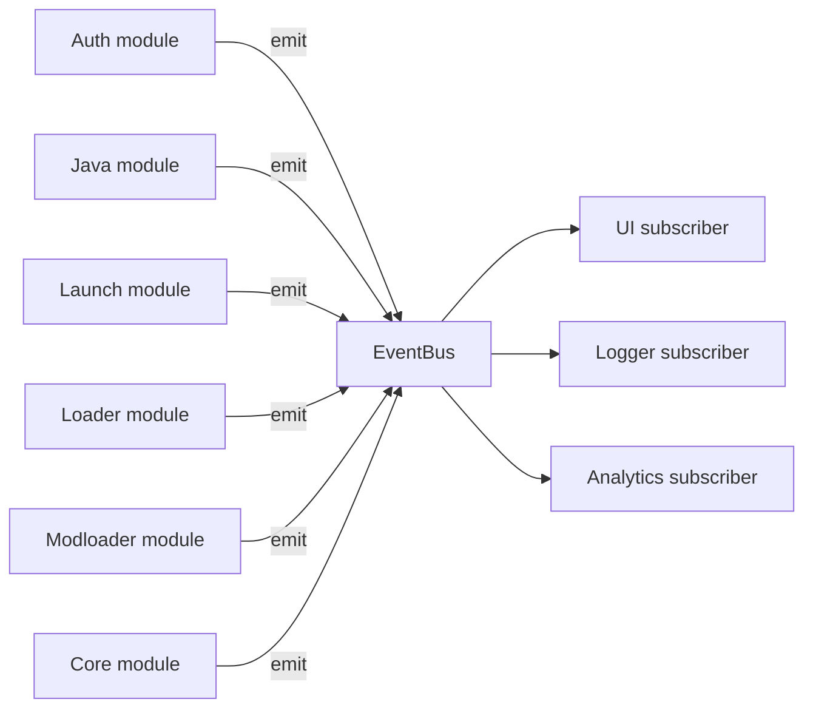

# lighty-event

Broadcast-based event bus used by every other crate in the workspace
to surface progress, lifecycle and console output to the host
application (CLI, GUI, log file, …).

## What it provides

| Type | Role |
|---|---|
| `EventBus` | Thin wrapper around `tokio::sync::broadcast::Sender<Event>`. Clone-able, send-able. |
| `EventReceiver` | Wrapper around the matching `broadcast::Receiver`. `next().await` for async loops, `try_next()` for non-blocking peeks. |
| `Event` | Root enum tagging which module emitted the event. |
| `EVENT_BUS` | Global `Lazy<EventBus>` with capacity 1000. Used by crates that don't take a bus parameter. |

The module enums (`AuthEvent`, `JavaEvent`, `LaunchEvent`,
`LoaderEvent`, `ModloaderEvent`, `CoreEvent`) and per-instance structs
are re-exported flat at the crate root.

## Why broadcast

- Multiple subscribers can share the same bus (UI + logger +
  analytics) — each gets its own copy.
- Slow subscribers don't backpressure producers; if the receive buffer
  overflows they surface `EventReceiveError::Lagged` and can decide
  how to recover.
- `Send + Sync + Clone` works in any Tokio task.

## Big picture

The bus has no built-in routing — every subscriber receives every
event and pattern-matches on the variant it cares about.

## See also

- [`events.md`](./events.md) — full catalogue of every variant
- [`how-to-use.md`](./how-to-use.md) — wiring a subscriber
- [`exports.md`](./exports.md) — public API surface
- [`architecture.md`](./architecture.md) — fan-out + threading model
- [`modules.md`](./modules.md) — file layout under `src/module/`
