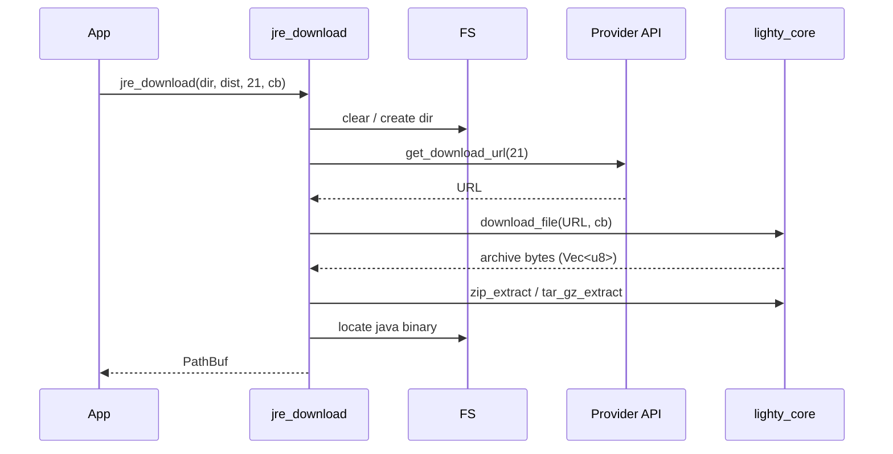

# Installation

`jre_downloader` is the pair of helpers that turn a
`(distribution, version)` into a path to a working `java` binary.

## API

```rust
// With `events`
pub async fn jre_download<F>(
    runtimes_folder: &Path,
    distribution: &JavaDistribution,
    version: &u8,
    on_progress: F,
    event_bus: Option<&EventBus>,
) -> JreResult<PathBuf>
where F: Fn(u64, u64);

// Without `events`
pub async fn jre_download<F>(
    runtimes_folder: &Path,
    distribution: &JavaDistribution,
    version: &u8,
    on_progress: F,
) -> JreResult<PathBuf>
where F: Fn(u64, u64);

// Available regardless of feature
pub async fn find_java_binary(
    runtimes_folder: &Path,
    distribution: &JavaDistribution,
    version: &u8,
) -> JreResult<PathBuf>;
```

Both helpers apply `JavaDistribution::get_fallback(version)`
internally, so calling them with a `(distribution, version)` that
isn't published on the current platform still returns a working
binary path (from the fallback). The same logic lets `find_java_binary`
locate an install made by `jre_download` with no extra bookkeeping.

## Pipeline



## Disk layout

```
<runtimes_folder>/
└── <distribution>_<version>/
    └── <jre_root>/                    # whatever the archive ships
        ├── bin/java[.exe]             # Linux / Windows / Liberica macOS
        └── Contents/Home/bin/java     # macOS bundles (Temurin, Zulu)
```

Example after `jre_download(<cache>/java, &Temurin, &21, …)`:

```
~/.cache/LightyLauncher/java/temurin_21/jdk-21.0.4+7-jre/bin/java
```

`prepare_installation_directory` wipes the target dir before each
install — installs are atomic from the caller's point of view.

## Locating the binary

`locate_binary_in_directory` handles three macOS layouts:

| Layout | Distribution | Path |
|---|---|---|
| `Contents/Home/bin/java` | Temurin | `<jre_root>/Contents/Home/bin/java` |
| `*.jre/Contents/Home/bin/java` | Zulu Java 8 on macOS | nested bundle |
| `bin/java` (flat) | Liberica tar.gz | `<jre_root>/bin/java` |

Linux uses `bin/java`; Windows uses `bin/java.exe`.

On Unix, `ensure_executable_permissions` `chmod`s the binary to `0o755`
before returning.

## Example

```rust
use lighty_core::AppState;
use lighty_java::{JavaDistribution, jre_downloader};

#[tokio::main]
async fn main() -> anyhow::Result<()> {
    AppState::init("LightyLauncher")?;
    let runtimes = AppState::cache_dir().join("java");

    let java = jre_downloader::jre_download(
        &runtimes,
        &JavaDistribution::Temurin,
        &21,
        |cur, tot| {
            if tot > 0 {
                println!("{:.1}%", cur as f64 * 100.0 / tot as f64);
            }
        },
        #[cfg(feature = "events")] None,
    ).await?;

    println!("java: {}", java.display());
    Ok(())
}
```

## With events

Pass `Some(&bus)` to receive the eight `JavaEvent` variants. See
[`events.md`](./events.md).

## Errors

```rust
pub enum JreError {
    NotFound { path: PathBuf },
    InvalidStructure,
    Download(String),       // wraps provider URL fetch + download_file
    UnsupportedOS,
    Io(std::io::Error),
    Extraction(String),     // wraps zip_extract / tar_gz_extract
}
```

## See also

- [`overview.md`](./overview.md) — crate scope
- [`distributions.md`](./distributions.md) — provider matrix
- [`runtime.md`](./runtime.md) — spawn `java` after install
- [`../../core/docs/extract.md`](../../core/docs/extract.md) — archive
  extraction internals
