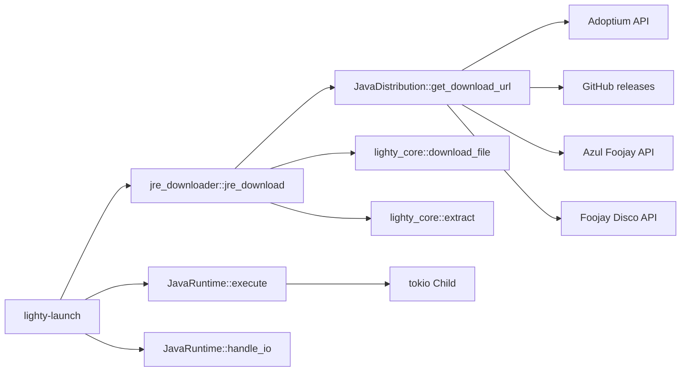

# lighty-java

JRE provisioning + Java process spawn for LightyLauncher. Two
responsibilities:

1. **Download a JRE** from one of four supported distributions
   (Temurin, GraalVM, Zulu, Liberica), extract it into the launcher
   cache, locate the `java` binary.
2. **Spawn a `java` process** with the right arguments and stream its
   stdout / stderr.

The crate doesn't know about Minecraft — it's a generic JRE installer
+ process runner. `lighty-launch` calls it after the version manifest
is resolved.

## What it provides

| Module | Surface |
|---|---|
| `jre_downloader` | `find_java_binary`, `jre_download` |
| `runtime` | `JavaRuntime::new`, `execute`, `handle_io` |
| `distribution` (private) | URL routing per provider — exposed via `JavaDistribution::get_download_url` |
| Root | `JavaDistribution`, `DistributionSelection`, error enums |

## JavaDistribution

```rust
pub enum JavaDistribution { Temurin, GraalVM, Zulu, Liberica }
```

Each variant maps to a different provider API. The default is
`Temurin` (widest version coverage). See
[`distributions.md`](./distributions.md) for the comparison matrix and
known gaps (e.g. no Java 8 for macOS aarch64).

`get_fallback(version) -> Option<JavaDistribution>` returns a
replacement distribution when the current one doesn't publish that
`(version, OS, arch)` combination — the downloader uses this
automatically.

## Cargo features

| Feature | Effect |
|---|---|
| `events` | `jre_download` accepts `Option<&EventBus>` and emits `JavaEvent::Java*`. |

## Big picture



## See also

- [`how-to-use.md`](./how-to-use.md) — install + run a JRE
- [`distributions.md`](./distributions.md) — picking a provider
- [`installation.md`](./installation.md) — `jre_download` walkthrough
- [`runtime.md`](./runtime.md) — `JavaRuntime` API + I/O streaming
- [`events.md`](./events.md) — the eight `JavaEvent` variants
- [`exports.md`](./exports.md) — public API surface
- [`../../event/docs/events.md`](../../event/docs/events.md) — workspace event catalogue
