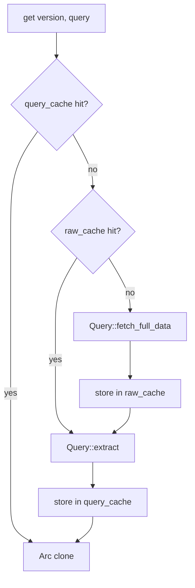

# Cache — TTL + thundering-herd guard

`ManifestRepository<Q>` (cf. [`query.md`](./query.md)) sits on top of
two `Cache<K, V>` layers. Each entry expires after the instance's
`VersionInfo::ttl()` (24 h by default).

## Two layers

| Layer | Key | Value | What it avoids |
|---|---|---|---|
| Raw cache | `String` (instance `name()`) | `Arc<F::Raw>` (parsed JSON / installer data) | Re-fetching the same manifest URL |
| Query cache | `QueryKey<F::Query>` | `Arc<F::Data>` (extracted slice) | Re-running `extract` |

Both live inside `ManifestRepository<F>`:

```rust,ignore
pub struct ManifestRepository<F: Query> {
    query_cache:       Arc<Cache<QueryKey<F::Query>, Arc<F::Data>>>,
    raw_version_cache: Arc<Cache<String, Arc<<F as Query>::Raw>>>,
    _marker:           PhantomData<F>,
}
```

`Cache<K, V>` is exported at `lighty_loaders::utils::cache::Cache` and
holds an internal `(Value, Instant)` map plus a per-key
`Mutex<Arc<()>>` for fetch serialization.

## Lookup flow



## Thundering-herd protection

`Cache::get_or_try_insert_with` takes a per-key fetch lock. If 100
callers ask for `vanilla-1.21.1` simultaneously, one runs the fetch
and the other 99 await the same `Arc<F::Raw>` — no duplicate HTTP
requests, no duplicate JSON parses.

The fetch locks live in a separate `RwLock<HashMap<K, Arc<Mutex<()>>>>`
so they don't contend with reads against the value store.

## Background cleanup

Both caches are constructed via `Cache::with_smart_cleanup()`, which
spawns a Tokio task that:

- Sleeps until the earliest entry's expiry (clamped to [1 s, 5 min]).
- Wakes early when notified via `cleanup_notify`.
- Sweeps expired values from the store and orphaned fetch-locks.

Expired entries are also evicted lazily on the next read, so the
background sweep is purely an optimisation for long-running processes.

## TTL configuration

There's no per-query TTL — the value comes from `VersionInfo::ttl()`,
defaulting to 24 hours. Override it on your `VersionInfo` impl to
tighten freshness for development builds or snapshots:

```rust,ignore
fn ttl(&self) -> std::time::Duration {
    std::time::Duration::from_secs(5 * 60)  // 5 minutes for snapshots
}
```

## Cache keys at a glance

| Loader | Raw key | Query key (`QueryKey { version, query }`) |
|---|---|---|
| Vanilla | instance `name` | `version: name`, `query: VanillaQuery::*` |
| Fabric | instance `name` | `query: FabricQuery::*` |
| Forge | instance `name` | `query: ForgeQuery::*` |
| LightyUpdater | instance `name` | `query: LightyUpdaterQuery::*` |

The `version` field on the query key is the instance name, not the
Minecraft version string — two `VersionBuilder`s with different
profile names get independent caches even when they target the same
MC version.

## Cache events

When the `events` feature is on, cache hits emit
`LoaderEvent::ManifestCached { loader }` and cache misses kick off a
`LoaderEvent::FetchingData` / `DataFetched` pair from the underlying
`Query` implementation. See [`events.md`](./events.md).

## See also

- [`overview.md`](./overview.md) — building blocks
- [`query.md`](./query.md) — `Query` trait + `ManifestRepository` usage
- [`traits.md`](./traits.md) — `VersionInfo::ttl` source of truth
