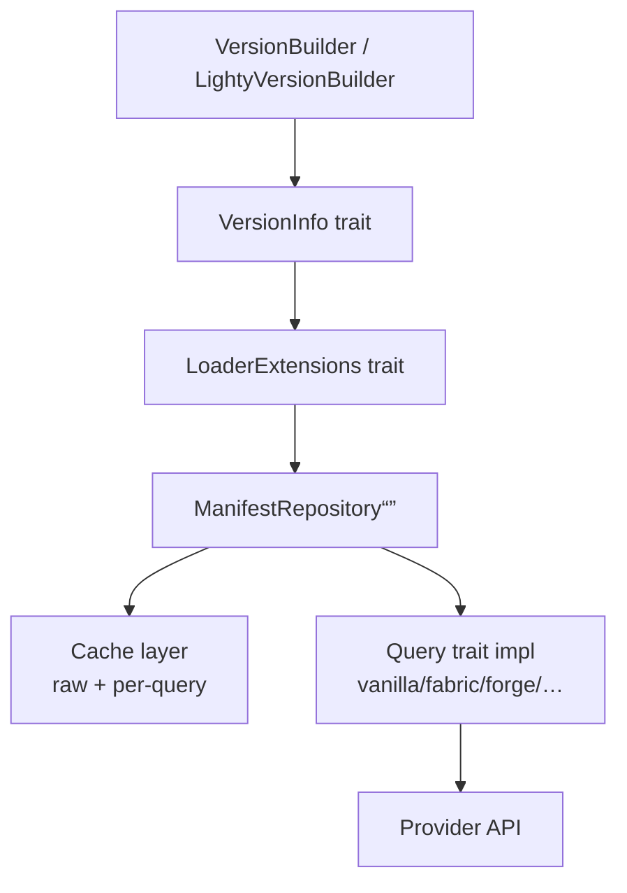

# lighty-loaders

Per-loader manifest fetching + metadata extraction for LightyLauncher.
Maps `(Loader, minecraft_version, loader_version)` to a fully-merged
`VersionMetaData` that the launch crate can install and execute.

Mod-source clients (Modrinth, CurseForge) live in a separate crate —
see [`lighty-modsloader`](../../modsloader/docs/overview.md).

## Supported loaders

| Loader | Feature flag | MC range | Status | Per-loader doc |
|---|---|---|---|---|
| Vanilla | `vanilla` | all | stable | [`loaders/vanilla.md`](./loaders/vanilla.md) |
| Fabric | `fabric` | 1.14+ | stable | [`loaders/fabric.md`](./loaders/fabric.md) |
| Quilt | `quilt` | 1.14+ | stable | [`loaders/quilt.md`](./loaders/quilt.md) |
| NeoForge | `neoforge` | 1.20.1+ | stable | [`loaders/neoforge.md`](./loaders/neoforge.md) |
| Forge | `forge` | 1.5.2+ (legacy + modern in one flag) | stable | [`loaders/forge.md`](./loaders/forge.md) |
| OptiFine | always on (uses `vanilla`) | varies | experimental | [`loaders/optifine.md`](./loaders/optifine.md) |
| LightyUpdater | `lighty_updater` | any (server-defined) | stable | [`loaders/lighty_updater.md`](./loaders/lighty_updater.md) |

The `forge` feature covers both **modern** (≥ 1.13) and **legacy**
(1.5.2 → 1.12.2) Forge — the loader detects the right install schema
from the installer JAR. There's no separate `forge_legacy` feature.

`lighty_updater` activates `fabric`, `quilt`, `neoforge` and `forge`
at the workspace level so a LightyUpdater server can pick any base
loader.

## Core building blocks



| Building block | Lives in | Docs |
|---|---|---|
| `VersionInfo` trait | `types::VersionInfo` | [`traits.md`](./traits.md) |
| `LoaderExtensions` trait | `types::LoaderExtensions` | [`traits.md`](./traits.md) |
| `Loader` enum | `types::Loader` | this page |
| `Query` trait | `utils::query::Query` | [`query.md`](./query.md) |
| `ManifestRepository<Q>` | `utils::manifest::ManifestRepository` | [`query.md`](./query.md) |
| `Cache<K, V>` | `utils::cache::Cache` | [`cache.md`](./cache.md) |
| `VersionMetaData` family | `types::version_metadata` | see source |
| `InstanceSize` | `types::InstanceSize` | [`exports.md`](./exports.md) |

## How a query flows

1. The host crate creates a `VersionBuilder` (or
   `LightyVersionBuilder`) — both implement `VersionInfo`.
2. The blanket `LoaderExtensions` impl matches on the
   `Loader` variant and dispatches to the right `ManifestRepository`.
3. The repository checks its `query_cache`; on miss it falls back to
   the `raw_cache`; on miss again it calls `Query::fetch_full_data`
   and `Query::extract`.
4. Results land back wrapped in `Arc<VersionMetaData>` so concurrent
   subscribers share the same allocation.

## Cargo features

```toml
[dependencies]
lighty-loaders = { version = "...", features = ["fabric", "forge"] }
```

`all-loaders` is the shortcut for everything (vanilla + fabric + quilt
+ neoforge + forge + lighty_updater + all-mods). Mod-source flags
(`modrinth`, `curseforge`, `all-mods`) light up extra optional
dependencies and switch on the equivalent modsloader features at the
workspace level.

`events` (workspace) routes `LoaderEvent` variants through
`lighty_event::EVENT_BUS`.

## See also

- [`how-to-use.md`](./how-to-use.md) — minimum-viable example
- [`traits.md`](./traits.md) — `VersionInfo` + `LoaderExtensions`
- [`query.md`](./query.md) — implementing a new loader
- [`cache.md`](./cache.md) — TTL behaviour + thundering-herd guard
- [`events.md`](./events.md) — `LoaderEvent` variants
- [`exports.md`](./exports.md) — public API surface
- Per-loader pages: [`loaders/`](./loaders/)
- [`../../version/docs/how-to-use.md`](../../version/docs/how-to-use.md)
  — `VersionBuilder` / `LightyVersionBuilder` canonical reference
- [`../../launch/docs/installation.md`](../../launch/docs/installation.md)
  — what the launch pipeline does with the resolved metadata
