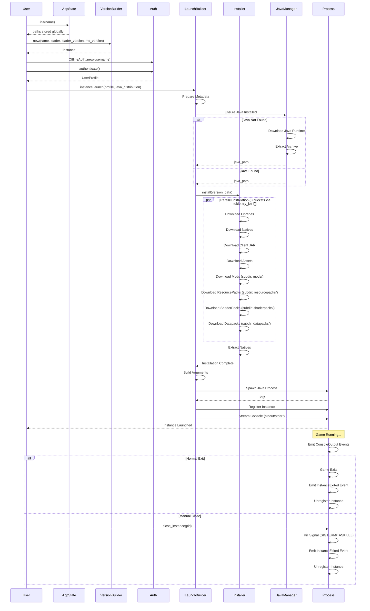
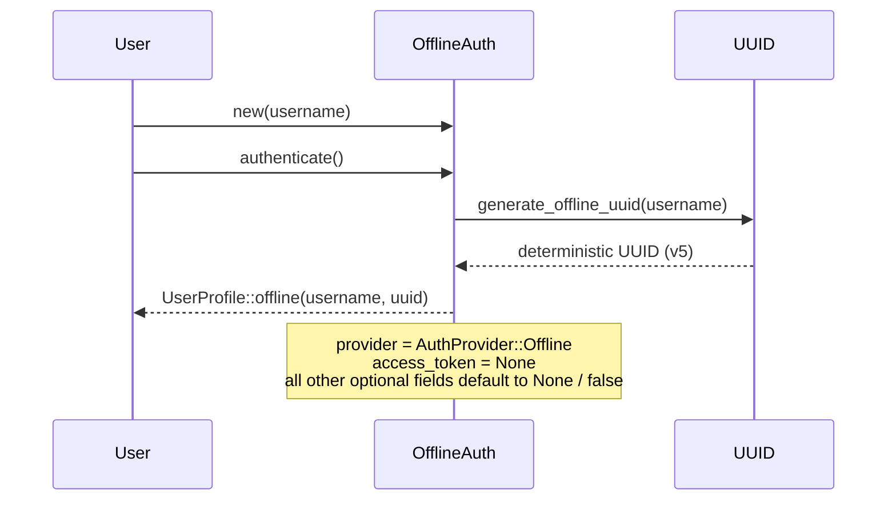
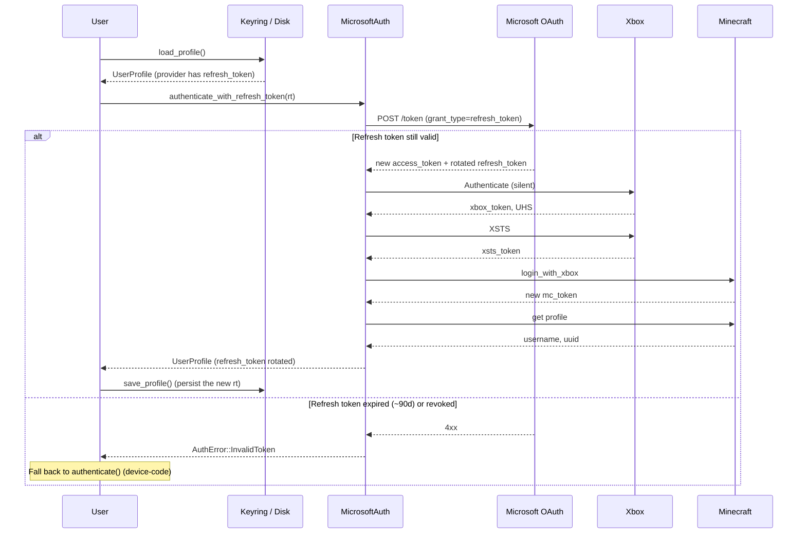
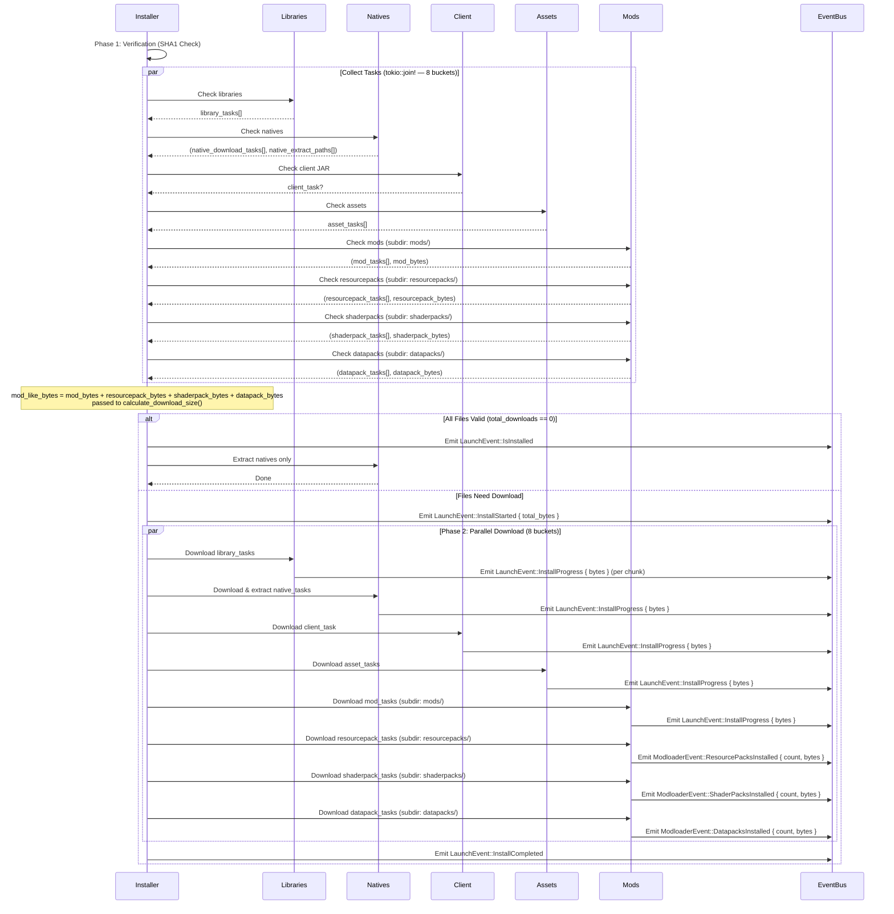
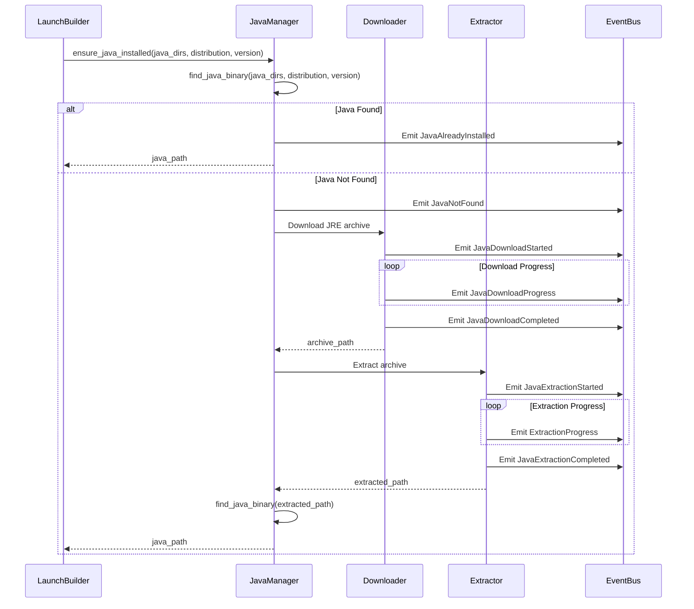
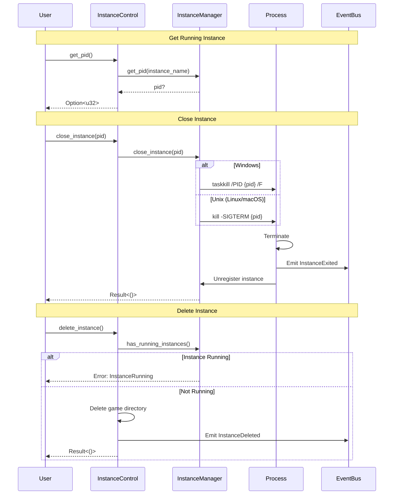
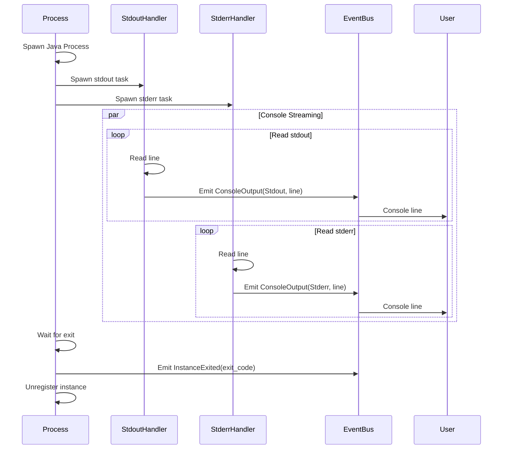
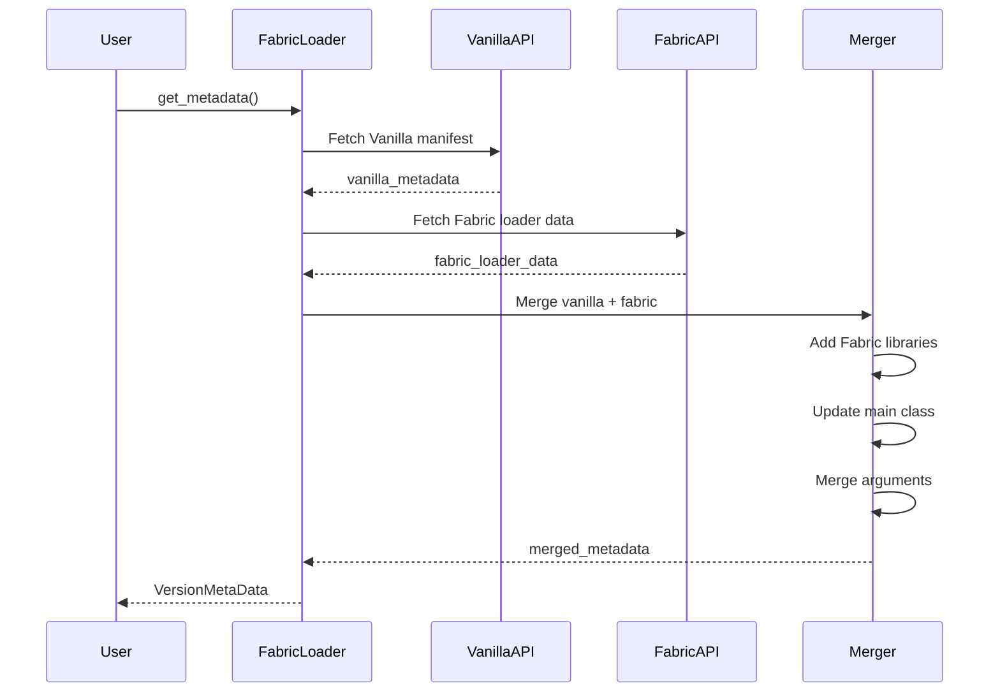

# Sequence Diagrams

## Complete Launch Sequence



## Authentication Sequence

### Offline Authentication



### Microsoft Authentication

```mermaid
sequenceDiagram
    participant User
    participant MicrosoftAuth
    participant DeviceFlow
    participant Xbox
    participant Minecraft

    User->>MicrosoftAuth: new(client_id)
    User->>MicrosoftAuth: authenticate(event_bus)

    MicrosoftAuth->>DeviceFlow: Request Device Code
    DeviceFlow-->>MicrosoftAuth: device_code, user_code, verification_url
    MicrosoftAuth->>User: Display: "Visit {url}, Enter {code}"

    loop Poll for completion
        MicrosoftAuth->>DeviceFlow: Poll for token
        alt User Authorized
            DeviceFlow-->>MicrosoftAuth: access_token + refresh_token
        else Still Pending
            DeviceFlow-->>MicrosoftAuth: authorization_pending
        end
    end

    MicrosoftAuth->>Xbox: Authenticate with Xbox Live
    Xbox-->>MicrosoftAuth: xbox_token, user_hash (UHS)

    MicrosoftAuth->>Xbox: Get XSTS Token
    Xbox-->>MicrosoftAuth: xsts_token

    MicrosoftAuth->>Minecraft: Authenticate with Minecraft (XBL3.0 x=UHS;xsts_token)
    Minecraft-->>MicrosoftAuth: minecraft_access_token

    Note over MicrosoftAuth: Decode xuid from MC token JWT payload
    Note over MicrosoftAuth: (authlib expects it to match --xuid)

    MicrosoftAuth->>Minecraft: Get Profile (Bearer mc_token)
    Minecraft-->>MicrosoftAuth: username, uuid

    MicrosoftAuth-->>User: UserProfile {
        username, uuid,
        access_token: Some(SecretString::from(mc_token)),
        token_handle: None (or Some(handle) if with_keyring),
        xuid: Some(xuid),
        provider: AuthProvider::Microsoft {
            client_id,
            refresh_token: Some(SecretString::from(rt))
        }
    }
    Note over MicrosoftAuth: access_token + refresh_token wrapped in SecretString.<br/>If with_keyring(service) was set, both are written to the OS keychain<br/>and access_token is None — only a TokenHandle is returned.
```

### Silent Re-authentication

After the first device-code flow, subsequent launches can skip user
interaction entirely by reusing the persisted refresh token:



## Installation Sequence



## Java Management Sequence



## Instance Control Sequence



## Console Streaming Sequence



## Event Flow Diagram

```mermaid
flowchart TB
    Start([User Initiates Launch]) --> InitState[Initialize AppState]
    InitState --> CreateVersion[Create VersionBuilder]
    CreateVersion --> Auth[Authenticate User]

    Auth --> |OfflineAuth| OfflineEvent[Emit AuthenticationStarted/Success]
    Auth --> |MicrosoftAuth| MSEvents[Emit Device Code Events]

    OfflineEvent --> StartLaunch[Call launch()]
    MSEvents --> StartLaunch

    StartLaunch --> FetchMeta[Fetch Loader Metadata]
    FetchMeta --> |Emit LoaderEvent| CheckJava[Check Java Installation]

    CheckJava --> |Not Found| DownloadJava[Download Java]
    CheckJava --> |Found| InstallDeps[Install Dependencies]

    DownloadJava --> |Emit JavaEvents| InstallDeps

    InstallDeps --> Verify{All Files Valid?}

    Verify --> |Yes| EmitInstalled[Emit IsInstalled]
    Verify --> |No| EmitStart[Emit InstallStarted]

    EmitInstalled --> ExtractNatives[Extract Natives Only]
    EmitStart --> ParallelDownload[Parallel Download]

    ParallelDownload --> |Libraries| LibEvents[Emit InstallProgress per chunk]
    ParallelDownload --> |Natives| NatEvents[Emit InstallProgress per chunk]
    ParallelDownload --> |Client| ClientEvents[Emit InstallProgress per chunk]
    ParallelDownload --> |Assets| AssetEvents[Emit InstallProgress per chunk]
    ParallelDownload --> |Mods| ModEvents[Emit InstallProgress per chunk]
    ParallelDownload --> |ResourcePacks| RPEvents[Emit ModloaderEvent::ResourcePacksInstalled]
    ParallelDownload --> |ShaderPacks| SPEvents[Emit ModloaderEvent::ShaderPacksInstalled]
    ParallelDownload --> |Datapacks| DPEvents[Emit ModloaderEvent::DatapacksInstalled]

    LibEvents --> EmitComplete[Emit InstallCompleted]
    NatEvents --> EmitComplete
    ClientEvents --> EmitComplete
    AssetEvents --> EmitComplete
    ModEvents --> EmitComplete
    RPEvents --> EmitComplete
    SPEvents --> EmitComplete
    DPEvents --> EmitComplete
    ExtractNatives --> EmitComplete

    EmitComplete --> BuildArgs[Build Arguments]
    BuildArgs --> SpawnProcess[Spawn Java Process]
    SpawnProcess --> Register[Register Instance]
    Register --> EmitLaunched[Emit InstanceLaunched]

    EmitLaunched --> StreamConsole[Stream Console Output]
    StreamConsole --> |Each Line| EmitConsole[Emit ConsoleOutput]

    EmitConsole --> WaitExit{Process Running?}
    WaitExit --> |Yes| StreamConsole
    WaitExit --> |No| EmitExited[Emit InstanceExited]

    EmitExited --> Cleanup[Unregister Instance]
    Cleanup --> End([Launch Complete])
```

## Loader-Specific Sequences

### Fabric Loader



### LightyUpdater

```mermaid
sequenceDiagram
    participant User
    participant LightyBuilder
    participant ServerAPI
    participant Vanilla

    User->>LightyBuilder: new(name, server_url)
    User->>LightyBuilder: get_metadata()

    LightyBuilder->>ServerAPI: GET {server_url}/version
    ServerAPI-->>LightyBuilder: {
        minecraft_version,
        loader,             // "vanilla" | "fabric" | "quilt" | "neoforge" | "forge"
        loader_version,
        mods: [...]
    }

    LightyBuilder->>Vanilla: Fetch base-loader metadata
    Note over LightyBuilder,Vanilla: loader = "forge" now supported in<br/>merge_metadata.rs (mapped to Loader::Forge).<br/>The lighty_updater feature already activates the<br/>forge feature at the workspace level.
    Vanilla-->>LightyBuilder: base_metadata

    LightyBuilder->>LightyBuilder: Add server mods to metadata
    LightyBuilder-->>User: VersionMetaData with custom mods
```

## Related Documentation

- [Launch Process](../crates/launch/docs/launch.md) - Detailed launch flow
- [Installation](../crates/launch/docs/installation.md) - Installation details
- [Instance Control](../crates/launch/docs/instance-control.md) - Process management
- [Events](../crates/launch/docs/events.md) - Event types reference
